<div align="center">

# 🚀 AutoStartup

### AI-Powered Startup Idea Analyzer & GitHub Scaffolder

*Transform a startup idea into a market-analyzed, architecturally designed, and fully scaffolded GitHub repository — powered by a coordinated crew of specialized AI agents*

<br/>

[](https://www.python.org/)
[](https://www.crewai.com/)
[](https://ai.google.dev/)
[](https://fastapi.tiangolo.com/)

[](https://react.dev/)
[](https://www.typescriptlang.org/)
[](https://vitejs.dev/)
[](https://tailwindcss.com/)
[](https://docs.github.com/en/rest)

</div>

---

## Demo

<div align="center">
  <a href="https://youtu.be/QE6VCR_Jxso">
    
  </a>
  <br/>
  <em>▶ Click to watch the full demo on YouTube</em>
</div>

---

## Overview

AutoStartup eliminates the gap between having a startup idea and getting to a working codebase. A pipeline of **four specialized AI agents** coordinates autonomously — researching competitors, discovering market gaps, designing a technical architecture, and scaffolding a real GitHub repository — all powered by Google Gemini 2.5 Flash Lite.

> **"An app to assist diabetic patients with meal plans and health tracking"** → Market Analyzed → Gaps Identified → Architecture Designed → GitHub Repo Created ✅

### Why Multi-Agent?

| Single-Model Approach | AutoStartup Multi-Agent |
|---|---|
| One model handles everything | Each agent is a domain expert |
| Context window fills up quickly | Agents pass structured typed outputs |
| No specialization or separation of concerns | Dedicated agents for research, analysis, architecture, and execution |
| Hard to debug or extend | Isolated agents with Pydantic-typed outputs |
| No real-world actions | Directly creates GitHub repositories via API |

---

## Architecture

```mermaid
graph TB
    subgraph FE["🖥️ Frontend · Port 5173"]
        UI["React 18 + TypeScript\nShadcn UI + Tailwind CSS"]
        TQ["TanStack Query\nPolling for Progress"]
    end

    subgraph BE["⚙️ Backend · Port 8000"]
        API["FastAPI Server"]
        TM["Task Manager\nBackground Thread Pool"]
    end

    subgraph Crew["🤖 CrewAI Hierarchical Crew"]
        direction LR
        MGR["🧠 Manager Agent\nGemini 2.5 Flash Lite\nOrchestrates & Delegates"]
        MR["🔍 Market Researcher\nGemini 2.5 Flash Lite"]
        GF["💡 Gap Finder\nGemini 2.5 Flash Lite"]
        TA["🏗️ Technical Architect\nGemini 2.5 Flash Lite"]
        GB["🐙 GitHub Builder\nGemini 2.5 Flash Lite"]
    end

    subgraph External["☁️ External Services"]
        SERPER["Serper Search API\nWeb Research"]
        GHAPI["GitHub API\nRepo Scaffolding"]
    end

    UI -->|"POST /api/startup/analyze"| API
    UI -->|"GET /api/startup/status/{job_id}"| API
    API --> TM
    TM --> Crew
    MGR --> MR
    MGR --> GF
    MGR --> TA
    MGR --> GB
    MR <-->|"search"| SERPER
    GB <-->|"create repo + push files"| GHAPI
```



---

## Agent Workflow

```mermaid
flowchart TD
    A([💬 Startup Idea Input])

    subgraph Crew["🤖 CrewAI Hierarchical Pipeline"]
        MGR["🧠 Manager Agent\nOrchestrates task delegation"]
        B["🔍 Competitor Analysis\n<i>Market Researcher Agent</i>\nIdentify 2-3 direct competitors\nwith features, pricing & weaknesses"]
        C["💡 Gap Analysis\n<i>Gap Finder Agent</i>\nIdentify market gaps\n& USP positioning"]
        D["🏗️ Technical Planning\n<i>Technical Architect Agent</i>\nDesign JSON blueprint:\nrepo structure, stack, file contents"]
        E["🐙 GitHub Scaffolding\n<i>GitHub Builder Agent</i>\nCreate real GitHub repo\nwith all files populated"]
    end

    OUT1[("📄 competitive_analysis.md")]
    OUT2[("📄 gap_analysis.md")]
    OUT3[("📄 scaffolding_plan.json")]
    OUT4[("🔗 GitHub Repository URL")]

    A --> MGR
    MGR --> B
    B --> OUT1
    OUT1 --> C
    C --> OUT2
    OUT2 --> D
    D --> OUT3
    OUT3 --> E
    E --> OUT4

    style B fill:#D1ECF1,stroke:#17A2B8,color:#333
    style C fill:#D4EDDA,stroke:#28A745,color:#333
    style D fill:#FFF3CD,stroke:#FFC107,color:#333
    style E fill:#F8D7DA,stroke:#DC3545,color:#333
    style MGR fill:#E2D9F3,stroke:#6F42C1,color:#333
```



---

## Agent Profiles

| Agent | Role | Tools | Output |
|---|---|---|---|
| 🧠 **Manager** | Orchestrates and delegates work across all agents | — | Delegation directives |
| 🔍 **Market Researcher** | Scours the web for 2-3 direct competitors with detailed analysis | Serper Search API | `competitive_analysis.md` |
| 💡 **Gap Finder** | Reads competitor analysis, identifies unmet needs & unique positioning | — | `gap_analysis.md` |
| 🏗️ **Technical Architect** | Designs full tech stack, file structure, and code scaffold in JSON | — | `scaffolding_plan.json` |
| 🐙 **GitHub Builder** | Creates the GitHub repo and populates every file from the blueprint | GitHub API | Live GitHub repository URL |

---

## Output Artifacts

After a successful run, the following files are generated in `outputs/`:

```
outputs/
├── competitive_analysis.md     # Competitor breakdown with features, pricing & weaknesses
├── gap_analysis.md             # Market gap report with USP recommendations
├── scaffolding_plan.json       # Full JSON blueprint: repo name, stack, files + content
└── github_repo_url.md          # The live GitHub repository URL
```

The GitHub repository is created with all files populated and ready to clone.

---

## API Reference

The FastAPI backend exposes a REST API for async job management with real-time progress tracking.

### Base URL
```
http://127.0.0.1:8000
```

### Endpoints

| Method | Endpoint | Description |
|---|---|---|
| `POST` | `/api/startup/analyze` | Start a new analysis job — returns `job_id` |
| `GET` | `/api/startup/status/{job_id}` | Poll job status and progress (0–100%) |
| `GET` | `/api/startup/results/{job_id}` | Get all completed task results |
| `GET` | `/api/startup/results/{job_id}/task/{task_name}` | Get a specific task's result |
| `DELETE` | `/api/startup/jobs/{job_id}` | Delete a job |
| `GET` | `/api/startup/jobs` | List all jobs |

### Example

```bash
# Start analysis
curl -X POST http://127.0.0.1:8000/api/startup/analyze \
  -H "Content-Type: application/json" \
  -d '{"idea": "An app to assist diabetic patients with meal plans and health tracking"}'

# {"job_id": "abc123", "status": "pending"}

# Poll for progress
curl http://127.0.0.1:8000/api/startup/status/abc123

# {"status": "running", "progress": 50, "completed_tasks": ["competitor_analysis", "gap_finding"]}

# Get results
curl http://127.0.0.1:8000/api/startup/results/abc123
```

---

## Project Structure

```
autostartup/
├── src/autostartup/
│   ├── crew.py                    # CrewAI crew definition (agents + tasks + callbacks)
│   ├── main.py                    # CLI entry point
│   ├── models.py                  # Pydantic models
│   ├── config/
│   │   ├── agents.yaml            # Agent roles, goals & backstories
│   │   └── tasks.yaml             # Task definitions with expected outputs
│   ├── api/
│   │   ├── main.py                # FastAPI application & route handlers
│   │   ├── models.py              # Request/response Pydantic models
│   │   └── task_manager.py        # Thread-safe background job manager
│   └── tools/
│       ├── github_tools.py        # GitHubScaffolderTool (PyGithub integration)
│       └── orchestrator_tools.py  # Workflow routing tools
├── frontend/                      # React + TypeScript + Shadcn UI frontend
│   ├── src/
│   └── package.json
├── outputs/                       # Generated analysis artifacts
├── run_api.py                     # Uvicorn server startup script
├── pyproject.toml                 # Python project & dependency config
└── requirements_api.txt           # FastAPI server dependencies
```

---

## Installation

Ensure you have Python `>=3.10,<3.14` installed. This project uses [UV](https://docs.astral.sh/uv/) for dependency management.

### 1. Install UV

```bash
pip install uv
```

### 2. Install project dependencies

```bash
uv pip sync -r requirements_api.txt
```

### 3. Install API dependencies

```bash
pip install -r requirements_api.txt
```

### 4. Configure environment variables

Create a `.env` file in the project root:

```env
GEMINI_API_KEY=your_gemini_api_key
SERPER_API_KEY=your_serper_api_key
GITHUB_TOKEN=your_github_personal_access_token

API_HOST=127.0.0.1
API_PORT=8000
API_RELOAD=True
API_KEY=your_api_key
```

> **Get your keys:**
> - Gemini API key: [Google AI Studio](https://aistudio.google.com/)
> - Serper API key: [serper.dev](https://serper.dev/)
> - GitHub token: [GitHub Settings → Developer Settings → Personal Access Tokens](https://github.com/settings/tokens) *(needs `repo` scope)*

### 5. Install frontend dependencies

```bash
cd frontend
bun install
```

---

## Running the Project

### Option A — CLI (quickest)

Run the full agent pipeline directly from the terminal:

```bash
crewai run
```

This executes the crew with the default idea configured in `src/autostartup/main.py` and streams output to the console.

### Option B — Full Stack (API + Frontend)

**Start the backend:**

```bash
python run_api.py
```

**Start the frontend** (in a separate terminal):

```bash
cd frontend
bun dev
```

Open [http://localhost:5173](http://localhost:5173) and enter your startup idea in the UI. The frontend polls the API for real-time progress updates as each agent completes its task.

---

## Customizing

- **Change the startup idea**: Edit the `inputs` dict in `src/autostartup/main.py`
- **Modify agent behavior**: Edit `src/autostartup/config/agents.yaml`
- **Modify task instructions**: Edit `src/autostartup/config/tasks.yaml`
- **Add tools**: Extend `src/autostartup/tools/` and wire them up in `crew.py`
- **Change the LLM**: Update the `llm` field in `agents.yaml` (e.g., `gemini/gemini-2.0-flash`)

---

## Support

For support, questions, or feedback regarding AutoStartup or CrewAI:

- Visit the [CrewAI documentation](https://docs.crewai.com)
- Reach out via the [CrewAI GitHub repository](https://github.com/joaomdmoura/crewai)
- [Join the CrewAI Discord](https://discord.com/invite/X4JWnZnxPb)
- [Chat with the docs](https://chatg.pt/DWjSBZn)

Let's build the future of startups with the power of multi-agent AI.
